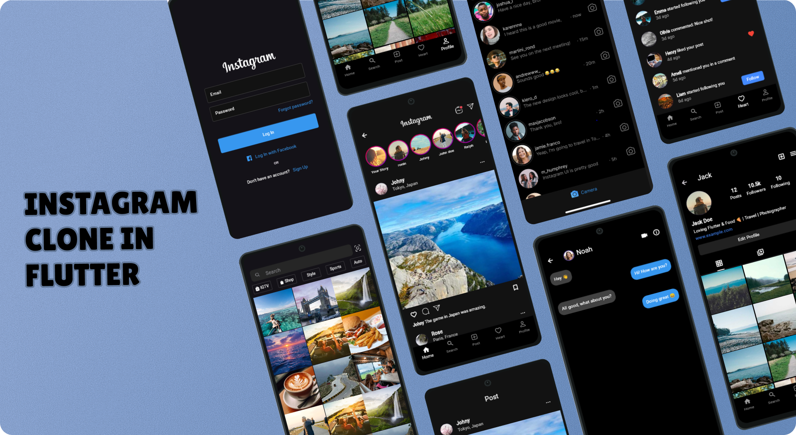

# 📸 Instagram Clone in Flutter



A clean and modern **Instagram Clone UI** built using **Flutter**.  
This project focuses on recreating the core Instagram interface with a smooth and responsive design.

---

## ✨ Features

- 🔐 Login Screen UI
- 📝 Sign Up Screen UI
- 🏠 Home Feed UI
- 🔍 Search Screen UI
- ➕ Create Post Screen UI
- 📷 Stories Section
- 💬 Chat / Messages UI
- 🔔 Notifications UI
- 👤 Profile Screen UI
- 🌙 Dark Mode Inspired Design
- 📱 Fully Responsive Layout

---

## 🛠 Built With

- **Dart**
- **Flutter**

---

## 🚀 Purpose of this Project

- Practice Flutter UI development
- Improve layout & design skills
- Understand social media app structure
- Build strong projects

---

## 📌 Status

🛠 Currently working on:

- Backend integration (Firebase – upcoming)
- State management improvements

---

## ▶️ How to Run This Project

```bash
flutter pub get
flutter run
Make sure Flutter SDK is installed and a device/emulator is connected.

🙌 Acknowledgements
Inspired by Instagram UI
Built with passion while learning Flutter 💙

👩‍💻 Author
Ramsha Ayub
Flutter Developer in progress 🚀
Learning. Building. Improving.

⭐ If you like this project, don’t forget to give it a star!